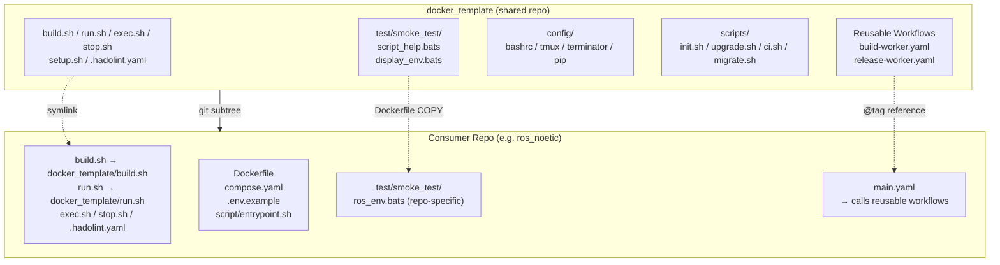
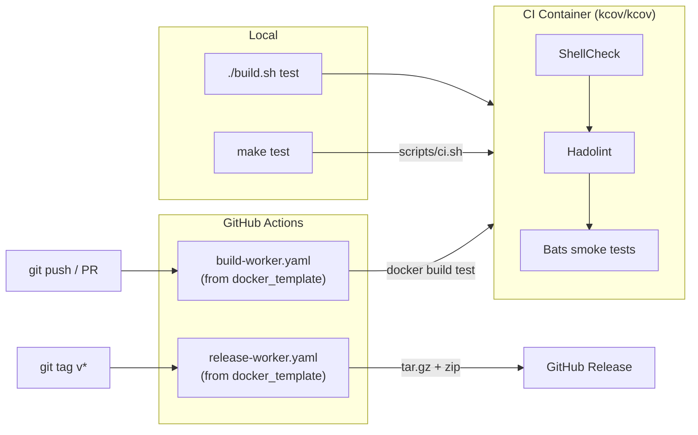

# docker_template

[](https://github.com/ycpss91255-docker/docker_template/actions/workflows/self-test.yaml)

[ycpss91255-docker](https://github.com/ycpss91255-docker) 組織下所有 Docker 容器 repo 的共用模板。

[English](../README.md) | [简体中文](README.zh-CN.md) | [日本語](README.ja.md)

## 概述

此 repo 集中管理所有 Docker 容器 repo 共用的腳本、測試和 CI workflow。各 repo 透過 **git subtree** 拉入此模板，並使用 symlink 引用共用檔案。

### Architecture



### CI/CD Flow



### 包含內容

| 檔案 | 說明 |
|------|------|
| `build.sh` | 建置容器（呼叫 `setup.sh` 產生 `.env`） |
| `run.sh` | 執行容器（支援 X11/Wayland） |
| `exec.sh` | 進入執行中的容器 |
| `stop.sh` | 停止並移除容器 |
| `setup.sh` | 自動偵測系統參數並產生 `.env` |
| `config/` | Shell 設定檔（bashrc、tmux、terminator、pip） |
| `test/smoke_test/` | 給各 consumer repo 使用的共用測試 |
| `.hadolint.yaml` | 共用 Hadolint 規則 |
| `.github/workflows/build-worker.yaml` | 可重用的 CI 建置 workflow |
| `.github/workflows/release-worker.yaml` | 可重用的 CI 發布 workflow |

### 各 repo 自行維護的檔案（不共用）

- `Dockerfile`
- `compose.yaml`
- `.env.example`
- `script/entrypoint.sh`
- `doc/` 和 `README.md`
- Repo 專屬的 smoke test

## 快速開始

### 加入新 repo

```bash
git subtree add --prefix=docker_template \
    git@github.com:ycpss91255-docker/docker_template.git main --squash

```

### 建立 symlinks

```bash
# 根目錄腳本
# 2. Initialize symlinks (one command)
./docker_template/scripts/init.sh
```
```

### 更新 subtree

```bash
